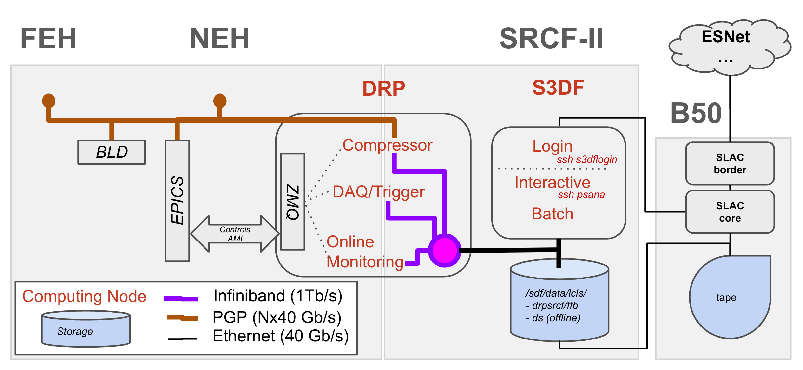

!!! note "Quicklinks"
    - **Account** - [Create a UNIX account][6]
    - **Computing** - [Access and Resources][1]
    - **Data Analysis** - for [LCLS-I][2] and for [LCLS-II][3]
    - **FFB docs** - [PCDS maintained documentation page][8]
    - **S3DF docs** - [PCDS maintained documentation page][4] + [official S3DF documentation][5].


# Step 1 - Get a computer account

To access and process your LCLS experiment data, you first need a valid SLAC UNIX account, enabled in the LCLS System.
To this end, you will need to follow the steps below (*and for more detailed information, check out this [Confluence documentation page][6]*).
The specific process depends on your role at SLAC.

## For LCLS Users

1. Apply for a UNIX account through the [User Portal](https://userportal.slac.stanford.edu/).
2. Take the course [CS101 - cyber security basics](http://training.slac.stanford.edu/web-training.asp).
3. Understand the [Acceptable Use of SLAC Information Technology Resources](https://policies.slac.stanford.edu/policy/acceptable-use-information-technology-resources).
4. The experiment spokesperson adds your UNIX account to the [Experiment Manager](https://pswww.slac.stanford.edu/lgbk/lgbk/experiments).

## For Interns and Collaborators

1. Fill out the [Site Access Request Form](https://erp-hprdext.erp.slac.stanford.edu/psc/hprdext/EMPLOYEE/HRMS/c/SL_DOE_FACT.SL_DOE_FACTS_USER.GBL?source=POI) to request a SLAC ID number. Non citizens will need to provide additional information including passport photos and the I-94 form available from the U.S. Customs and Boarder Protection [webpage](https://i94.cbp.dhs.gov/recent-search).
2. Your SLAC point of contact will receive an email containing the SLAC ID Number. Note that the process will take slightly longer for non US citizens.
3. Follow the "Manual Login" instructions to get a password and log into the [Web training portal](https://slactraining.slac.stanford.edu/web-training-portal-0).
4. Complete CS101 - cyber security basics
5. Your point of contact will request a UNIX account for you using the [SLAC Computer Account Request form](https://slacprod.servicenowservices.com/it_services?id=sc_cat_item&sys_id=17176b676ff12100aae0c6012e3ee4f7&sysparm_category=d65827c46fd921009c4235af1e3ee434). More info can be found about the process [here](https://it.slac.stanford.edu/support/KB0010082).


!!! note "Enabling access to the S3DF"
    The SLAC-wide Shared Science Data Facility ([S3DF](https://lcls-users.readthedocs.io/en/latest/glossary/#s3df)) will soon replace the computer and storage resources managed by LCLS Photon Controls and Data Systems ([PCDS](https://lcls-users.readthedocs.io/en/latest/glossary/#pcds)) currently used for LCLS experiment data management.
    In order to use S3DF, it is necessary to enable your S3DF account using your SLAC UNIX account. Detailed information in the [S3DF documentation here][7].

# Step 2 - Understand LCLS Data Systems
Now that you can access the computer systems at SLAC, it is time to get yourself oriented. 
For that, it is useful to understand how the data flows from the beamline to storage, *a.k.a* to understand the LCLS Data Systems, built with 3 successive levels:

| Level # | Processing Time | Storage Duration | Access |
| -- | -- | -- | -- |
| 1. Data Acquisition<br> and Reduction | diagnostics within <1s. | None.<br>Data is in shared memory.| **Experts only** |
| 2. Fast Feedback | diagnostics and results<br> within <1min.| <1 week. | *(before) -* through `pslogin` to `psffb`.<br> *(now) -* on S3DF. |
| 3. Offline Analysis | intensive compute during<br> and after the beamtime.| <4 months<br> before being moved to tape.| *(before) -* through `pslogin` to `psana`.<br> *(now) -* on S3DF |

The figure below provides a high-level map of the LCLS Data Systems presenting the main entities and their networks. (more TBD).

|  | 
|:--:| 
| *__LCLS Data Systems.__ TBD.* |


!!! danger "migration to S3DF"
    S3DF is a new capability at SLAC and is currently still a work in progress. 
    New experiments will be stored and processed on S3DF while previous experiments can still be access on the PCDS clusters.
    On S3DF, it will be more seamless to switch from online analysis to offline analysis between shifts and at the end of the beamtime.

# Step 3 - Access your experiment data

Your experiment data cannot be reached directly from external networks. You must first access a login node. 

|  | 
|:--:| 
| *__Pathways to the Experiment.__ TBD.* |

The exact pathway will depend on whether your experiment happened before 2023 or not and whether you intend to do online analyis on the FFB nodes or offline analysis. 
We detail these different scenarii below.

### Recent experiments (2023 - ...)

It is anticipated that experiments carried out in 2023 or after will be processed directly on S3DF. 
First, get in the system:
```
ssh <username>@s3dflogin.slac.stanford.edu
```
In order to get access to the data and to submit SLURM jobs, reach an interactive node:
```
ssh psana
```
Once on the interactive node, execute the following command (or place it in your `~/.bashrc`) in order to set the necessary environment variables and environments that will allow you to find the data and process it:
``` 
source /sdf/group/lcls/ds/ana/sw/conda1/manage/bin/psconda.sh
```
!!! note "FFB at S3DF"
    In S3DF, both FFB and Offline storage are accessible. By default, the command above points to the offline storage. In order to access the FFB storage, you can override the environment variable that points to the data:
    ```
    export SIT_PSDM_DATA=/sdf/data/lcls/drpsrcf/ffb
    ```
The experiments and their data can be found at the following path:
```
${SIT_PSDM_DATA}/<instrument>/<experiment>
```

!!! note "More S3DF info"
    For more information about the S3DF, check out the PCDS documentation [here][4] and the official S3DF docs [here][5].

### Past experiments (pre 2023)

First, get in the system:
```
ssh <username>@pslogin.slac.stanford.edu
```
From there, you can access the FFB nodes or offline analysis nodes:
```
ssh psana # offline nodes
# or 
ssh psffb # FFB nodes
```
In order to set the necessary environment to start processing it, execute the following command:
```
source /reg/g/psdm/etc/psconda.sh 
```
The experiments and their data can be found at the following path:
```
/cds/data/psdm/<instrument>/<experiment>     # Offline storage
/cds/data/drpsrcf/<instrument>/<experiment>  # FFB storage
```

!!! danger "Data import/export"
    Note that interactive nodes are not exposed to external networks. If you need to transfer data, you can go through `psexport.slac.stanford.edu`.

!!! note "More FFB info"
    For more information about the Fast Feedback System, check out the PCDS documentation [here][8].


[1]: https://confluence.slac.stanford.edu/pages/viewpage.action?pageId=92183280
[2]: https://confluence.slac.stanford.edu/display/PSDM/LCLS+Data+Analysis
[3]: https://confluence.slac.stanford.edu/display/LCLSIIData/LCLS-II+Data+Acquisition+and+Analysis
[4]: https://confluence.slac.stanford.edu/display/PCDS/Running+at+S3DF
[5]: https://s3df.slac.stanford.edu/public/doc/#/
[6]: https://confluence.slac.stanford.edu/display/PCDS/Accounts
[7]: https://s3df.slac.stanford.edu/public/doc/#/accounts-and-access
[8]: https://confluence.slac.stanford.edu/display/PCDS/Fast+Feedback+System
[9]: https://docs.nersc.gov/accounts/
