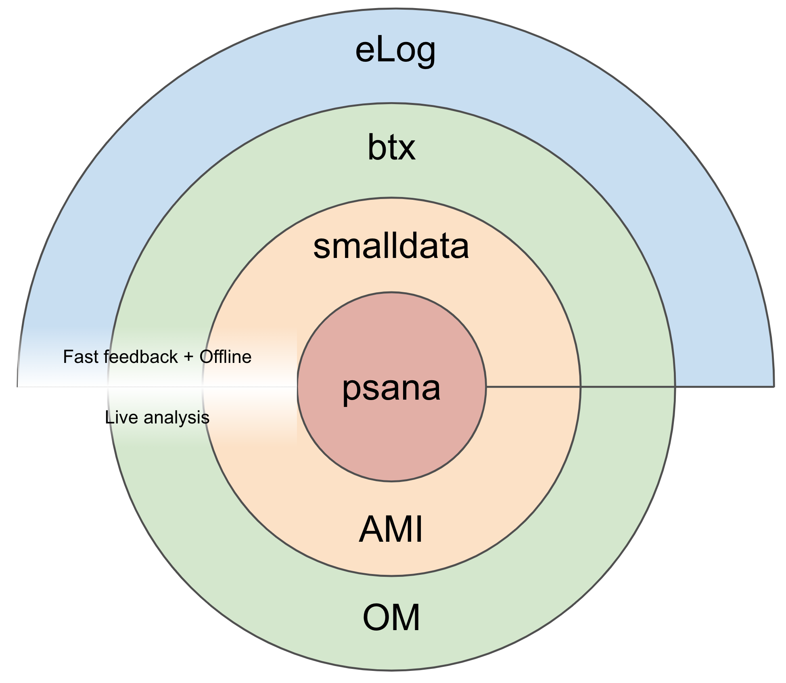
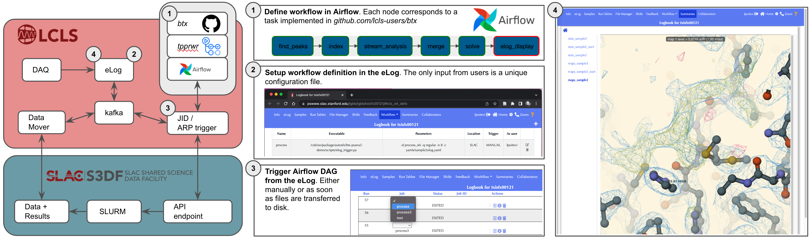

!!! note "Quicklink"
    - **btx** - [btx Github repository][1]
    - **documentation** - [btx code documentation][2]

# Routine beamtime analysis

LCLS offers several tools to help you analyze your experimental data. 
The chart below attempts at articulating them based on whether they are more generic tools like `psana` or more experiment specific like `OM` 
and whether they are mostly used for live analysis during beamtimes like `AMI` or for slightly delayed feedback or even offline like `smalldata` and `btx`. 
The `eLog` provides a unifying entrypoint from your browser.

|  | 
|:--:| 
| *__LCLS Data Analysis.__ TBD.* |


## The `btx` library and workflow manager {: #btx}

`btx` is a resource for analyzing experiments performed at LCLS, both during and after beamtime. 
To facilitate rapid analysis, common data processing steps have been organized into tasks that can be easily accessed from the eLog or command-line without users having to write new code. 
This is a primarily Python-based package to which contributions are welcome, as *btx* is intended as a library to serve the user community at LCLS. Currently most tasks are geared toward SFX data analysis, but we intend to expand the scope to encompass other experiments, such as SPI and SAXS/WAXS.

!!! note "Important concepts"
    `btx` is structured around the concept of **tasks** - elementary processing steps that are understood intuitively, such as "detector geometry refinement" or "crystal indexing".
    Tasks can be chained (linearly or not) into **DAGs** (directed acyclic graphs) and executed as **workflows**.

### Usage

In the next sections, we will see how the tasks listed in your configuration file can be run either from the command line, interactively or within workflows executed from the eLog.

#### Preparing the configuration file

To run *btx*, we first need to generate a configuration file that lists the desired tasks and defines their corresponding parameters. This file follows yaml format; a partial example file is shown below:
```yaml
setup:
  queue: 'anaq'
  root_dir: '/cds/data/drpsrcf/mfx/mfxx49820/scratch/btx'
  exp: 'mfxx49820'
  det_type: 'epix10k2M'

fetch_mask:
  dataset: '/data/data'

fetch_geom:

build_mask:
  thresholds: -10 5000
  n_images: 20
  n_edge: 1
  combine: True
```
The entries under `setup` define experiment parameters, while the remainder of the file lists individual tasks. Using any text editor, generate this configuration file in a `yaml` subdirectory within your experiment scratch folder:
```bash
${SIT_PSDM_DATA}/<instrument>/<experiment>/scratch/<my_directory>/yaml
```
where `${SIT_PSDM_DATA}` is one of the following:
```bash
/sdf/data/lcls/drpsrcf/ffb # S3DF cluster
/cds/data/drpsrcf # PCDS FFB cluster
/cds/data/psdm # PCDS psana cluster
```
For more information on these clusters, see the [Computing Accounts and Resources Page](/before/accounts/).

#### Performing tasks interactively

*Coming soon...*

#### Performing tasks from the command-line

To make the executable accessible, add the following line to your `~/.bashrc` for analysis on the PCDS clusters:
```bash
export PATH=/cds/sw/package/autosfx/btx/scripts:$PATH
```
or for analysis on S3DF:
```bash
export PATH=/sdf/group/lcls/ds/tools/btx/scripts:$PATH
```
This change can be applied by either running `source ~/.bashrc` or opening a new terminal.

We recommend always launching analysis tasks from the same directory within your scratch directory so that all the SLURM log files accumulate at that specific path. For example, we typically use the following hierarchy:
```bash
${SIT_PSDM_DATA}/{instrument}/{exp}/scratch/btx/
├── yaml/
|  └── default_config.yaml  # Experiment YAML file
└── launchpad # <- Launch files from here
```
If launching from within the `launchpad` directory, as above, a specific task can be run as follows:
```bash
elog_submit.sh -c ../yaml/default_config.yaml -t [my_task] -n [n_cores]
```
If running this from the psana cluster, the following arguments should be added to the above command: `-f SLAC -q psanaq`. Command-line arguments for the `elog_submit.sh` script follow:
```
| Flag  | Meaning                                             | Usage                |
| -f    | Facility: SRCF_FFB (FFB), SLAC (psana), or S3DF     | -f <facility>        |
| -q    | Queue to use.                                       | -q <queue>           |
| -a    | SLURM account, only relevant for S3DF               | -a <account>         |
| -t    | Task to run. Must match the name in the YAML file.  | -t <task>            |
| -c    | Path to the configuration file in YAML format.      | -c <config_file>     |
| -e    | Name of the experiment.                             | -e <experiment_name> |
| -r    | Run to process. If supplied override YAML value.    | -r <run_number>      |
```
A related executable, `submit_range_run.sh`, will launch the same task across a series of runs. This script can be run in the same fashion as `elog_submit.sh` and with the same flags, except an additional `-s` flag should be added that determines the last run number to process. 

More details about available tasks can be found in the relevant experiment pages.


#### Chaining tasks: launching workflows from the eLog

The figure below illustrates on an example how tasks can be chained as workflows which can be triggered from the eLog to be executed at S3DF and results displayed back in the eLog.
In your browser, you can access your {experiment} logbook (eLog) at the following URL: [https://pswww.slac.stanford.edu/lgbk/lgbk/{experiment}](). 

|  | 
|:--:| 
| *__Example of SFX workflow implemented with `btx`.__ 1) Define the Airflow workflow within `btx`, eventually making use of `tppwrw` to deploy containers. 2) Setup the workflows in the eLog. 3) Trigger the workflows manually or automatically from the eLog. 4) Check the results interactively in the eLog Summary panel.* |

##### Setup the workflow definition in the Elog
Navigate to the "Workflow definition" tab [https://pswww.slac.stanford.edu/lgbk/lgbk/{experiment}/#lcls_wf_defs]() (see step 2 in the figure above) and click on the "+" button located at the top right of the window. 
Enter the following information:

- *Name*: the memorable name you wish to call this workflow.
- *Trigger*: choose whether you will trigger the workflow manually or automatically.
- *Location*: leave "SLAC" for now. More soon...
- *Executable*: the path to the `btx` eLog trigger script: `/cds/sw/package/autosfx/btx/scripts/elog_trigger.py`.
- *Parameters*: the command-line arguments for the `elog_trigger.py` script. See just below for their description:

```
| Flag  | Meaning                                             | Usage                |
| -d    | Name of the DAG you wish to use.                    | -d <dag>             |
| -q    | Queue to use.                                       | -q <queue>           |
| -n    | Number of cores (soon deprecated)                   | -c <n_cores>         |
| -c    | Path to the configuration file in YAML format.      | -c <config_file>     |
```

##### Trigger the workflow from the eLog
Navigate to the "Workflow control" tab [https://pswww.slac.stanford.edu/lgbk/lgbk/{experiment}/#lcls_wf_jobs]() (see step 3 in the figure above). To trigger a worflow for a given run, select the workflow "Name" from the list in the "Job" column. 
To trigger it for multiple consecutive runs, click on the train icon at the top right of the window, select your workflow "Name" and enter the first and last run numbers to be processed.

##### Monitor the workflow results from the eLog
Navigate to the "Summaries" tab [https://pswww.slac.stanford.edu/lgbk/lgbk/{experiment}/#summaries]() (See step 4 in the figure above). 
In the navigation bar on the left of the window, you should see a list of "samples" and "runs" - click on them to display the results associated with the corresponding "sample" or "run".

### Contributing to the code

The repository can be cloned from this [Github link](https://github.com/lcls-users/btx). The `README.md` describes guidelines for contributing to the code. 

- Contributing a new task
:    New tasks should be added as separate functions to [tasks.py](https://github.com/lcls-users/btx/blob/main/scripts/tasks.py) and then can be run from the command-line as described above. 

- Contributing new workflows 
:    To create a new workflow, make sure the tasks you wish to chain in the DAG exist. Then create a new file in the `dags/` subfolder of `btx` (get some inspiration from the [existing ones](https://github.com/lcls-users/btx/tree/main/dags)). The DAG will be available shortly after your PR have been merged in the main `btx` branch.

[1]: https://github.com/lcls-users/btx
[2]: https://lcls-users.github.io/btx/