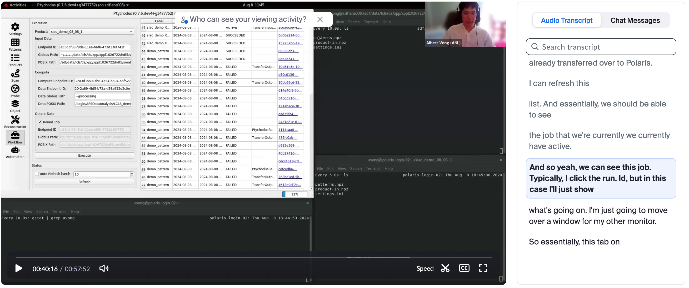
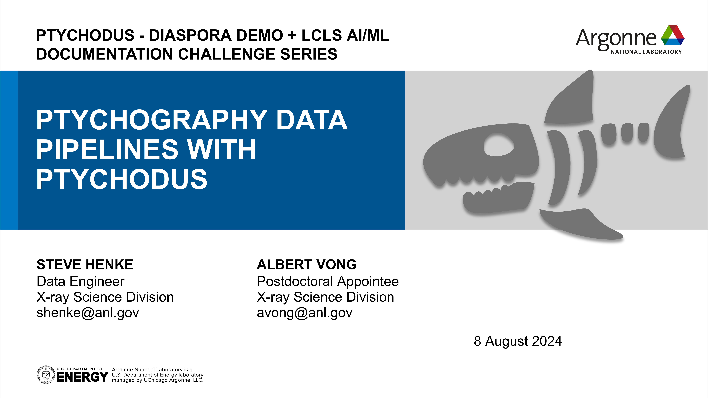

# Tutorials and Demos

 **Jump to:**
- [`Ptychodus`](#ptychodus)
- [`PeakNet`](#peaknet)
- [`ResoNet`](#resonet)

---
## Ptychodus Demo {: #ptychodus}
Ptychodus is a software solution that allows one to seamlessly process ptychography data across facilities through a user-friendly GUI. 
It handles data transfer and processing through Globus and accommodates several ptychography reconstruction algorithms, from traditional to ML-y.

 

 

[*(back to top)*](#toc)

## PeakNet {: #peaknet}

## ResoNet {: #resonet}