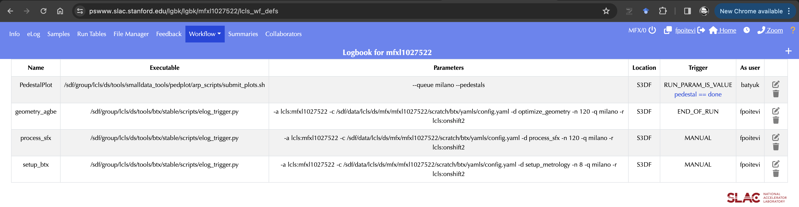
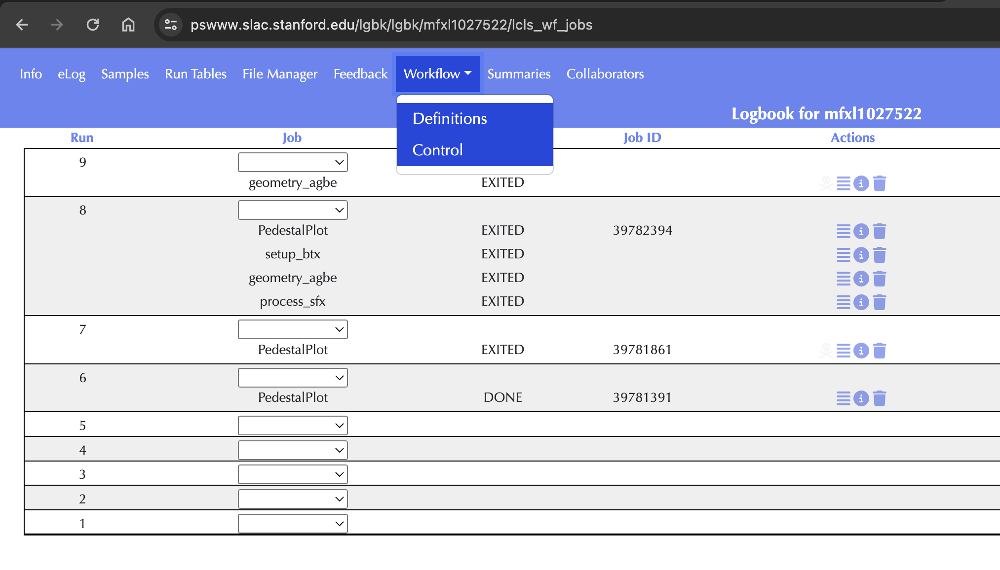
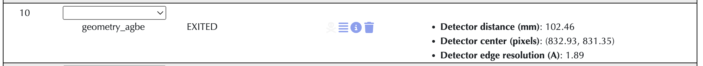
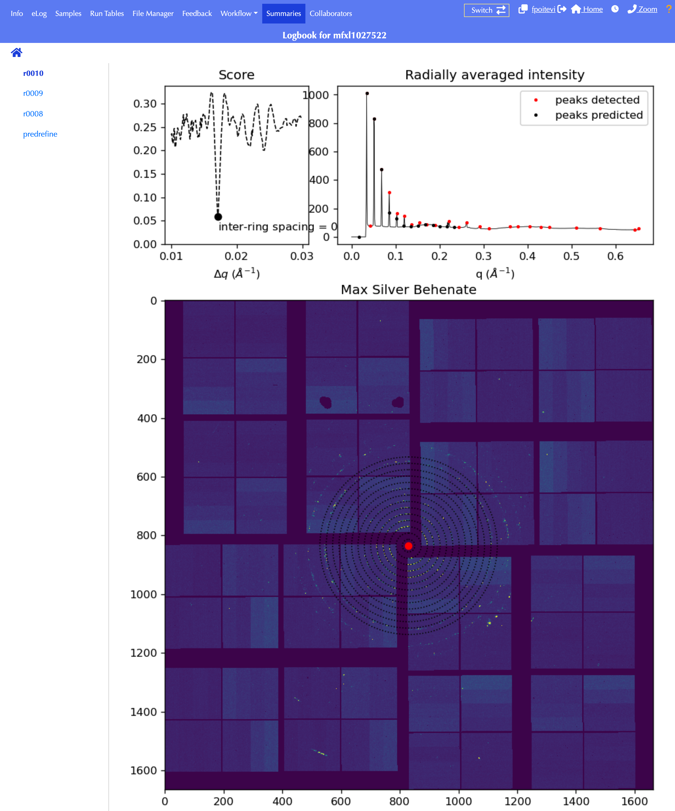
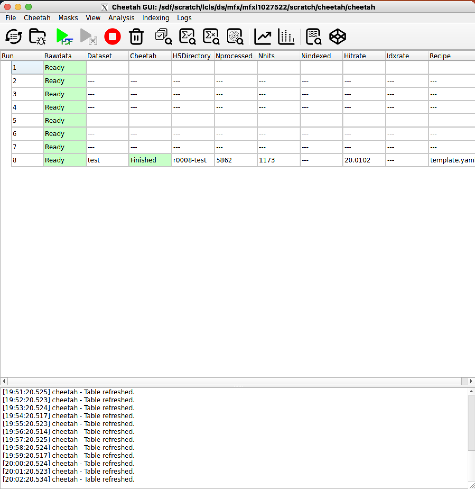
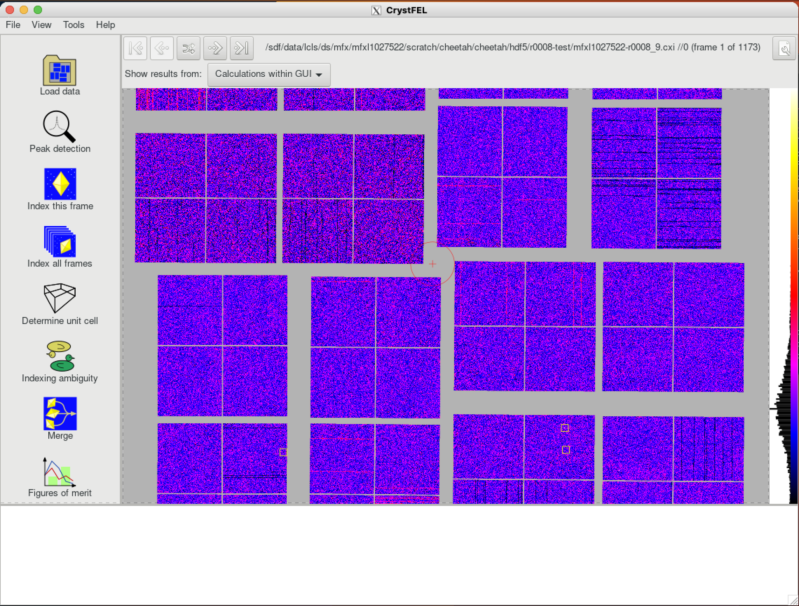

# SFX analysis toolkit {: #top}

<a name="toc"></a> **Jump to:**
- [`Running btx`](#btx)
- [`Running Cheetah`](#cheetah)
- [`Running Crystfel`](#crystfel)

---
## Automated SFX analysis with btx {: #btx}

### Setup `btx`
Ask your instrument scientist or data POC to setup `btx` in the eLog. They will essentially need to run something similar to the following:
```bash
(base) [fpoitevi@sdfiana002]$ setup_btx.sh -e <expermient> -n <ncores> -w sfx [-r <reservation>]
```

This script is provided with every `btx` release. A central installation is located on S3DF at `/sdf/group/lcls/ds/tools/btx/stable/scripts`.

 - `<experiment>` should be replaced the with full experiment name.
 - `<ncores>` should be replaced with the number of cores to use for processing. For most cases 120 or 240 cores is a good choice.
 - `-r <reservation>` is an optional flag to run with a SLURM reservation (e.g. `lcls:onshift2`). Discuss with the data POC if this is necessary. The use of reservations is slowly being phased out.

After the script has been run, go to the experiment's eLog page to make sure that the proper workflows have been defined. Workflows are located on the Workflows>Definitions tab. There are three `btx` workflows to look for (although workflows for other software may also be present):

- A `process_sfx` workflow. This runs the crystallography processing pipeline.
- An `optimize_geometry` workflow. This is used for optimizing detector geometry. This workflow is called "`setup_btx`" in the image below, following an older naming scheme.
- A `setup_metrology` workflow. This is a utility for making sure necessary files are available. This workflow is called "`setup_btx`" in the image below, following an older naming scheme.

|                                                                                                                                                |
|:--------------------------------------------------------------------------------------------------------------------------------------------------------------------------------------------------------:|
|                                                                                 __BTX workflow definition in the eLog.__                                                                                 |

The setup script will also create a `btx` directory in the experiment scratch folder, at the following path: `/sdf/data/lcls/ds/<hutch>/<experiment>/scratch/btx`. At this point, the `btx` directory looks like:
```bash
(base) [fpoitevi@sdfiana002 btx]$ tree
.
├── launchpad
└── yamls
    └── config.yaml
```

A template configuration file has been created (`config.yaml`), starting with the lines below. Below the `mfxl1025422` experiment is used as an example. The fields will be appropriately updated to reflect the experiment passed to the setup script. Importantly, `btx` will organize results under the `root_dir`. This is by default the folder in the scratch directory. You can change this to another directory if needed. Take a few minutes as well to make sure the rest of the parameters for each task are to your liking.
```bash
setup:
  queue: 'milano'
  account: 'lcls:mfxl1025422'
  reservation: ''
  root_dir: '/sdf/data/lcls/ds/mfx/mfxl1025422/scratch/btx/'
  exp: 'mfxl1025422'
  run: 5
  det_type: 'Rayonix'
  cell: ''

elog_display:

fetch_mask:
  dataset: '/entry_1/data_1/mask' # Rayonix - switch to /data/data for other det

fetch_geom:

...
```


### Trigger Geometry optimization workflow in the eLog

Click on the Workflow Controls tab and trigger the workflow for the desired run.

|  | 
|:---------------------------------------------------------------:| 
|            __BTX workflow controls from the eLog.__             |

### Monitor results

The measured distance between sample and detector will eventually be reported in the Workflow controls tab. 

|  | 
|:-----------------------------------------------------------------------------------:| 
|                      __BTX reporting of geometry inferred from Silver Behenate run.__                       |

Fitting plots will can be found in the "Summaries" page (go to ***runs > r0010*** where 10 is the run number).


|  | 
|:-----------------------------------------------------------------------------------------:| 
|              __BTX summary of geometry inferred from Silver Behenate run.__               |

---
## Running Cheetah {: #cheetah}

### Launch Cheetah

0. ssh to psana interactive node on S3DF.
1. go to central installation directory: `cd /sdf/group/lcls/ds/tools/om`
2. source cheetah environment: `source setup-cheetah.sh`
3. launch the GUI: `cheetah_gui.py`

### Setup experiment

1. when prompted, create new experiment or open existing experiment by pointing to your experiment's scratch folder (e.g. `/sdf/data/lcls/ds/<instrument>/<experiment>/scratch`)
2. go to ***File > Unlock command operations***
3. go to ***File > Start crawler***
4. Profit!

|  | 
|:------------------------------:| 
|          __Cheetah.__          |


---
## Running Crystfel {: #crystfel}

### Launch Crystfel

0. ssh to psana interactive node on S3DF.
1. load the crystfel module: 
```bash
export MODULEPATH=$MODULEPATH:/sdf/group/lcls/ds/tools/crystfel/modulefiles
module load crystfel/0.10.2
crystfel
```

### Setup experiment

Load data and point to the run folder under Cheetah's hdf5 directory. Also point to the Cheetah geometry file.

|  | 
|:--------------------------------:| 
|          __Crystfel.__           |
