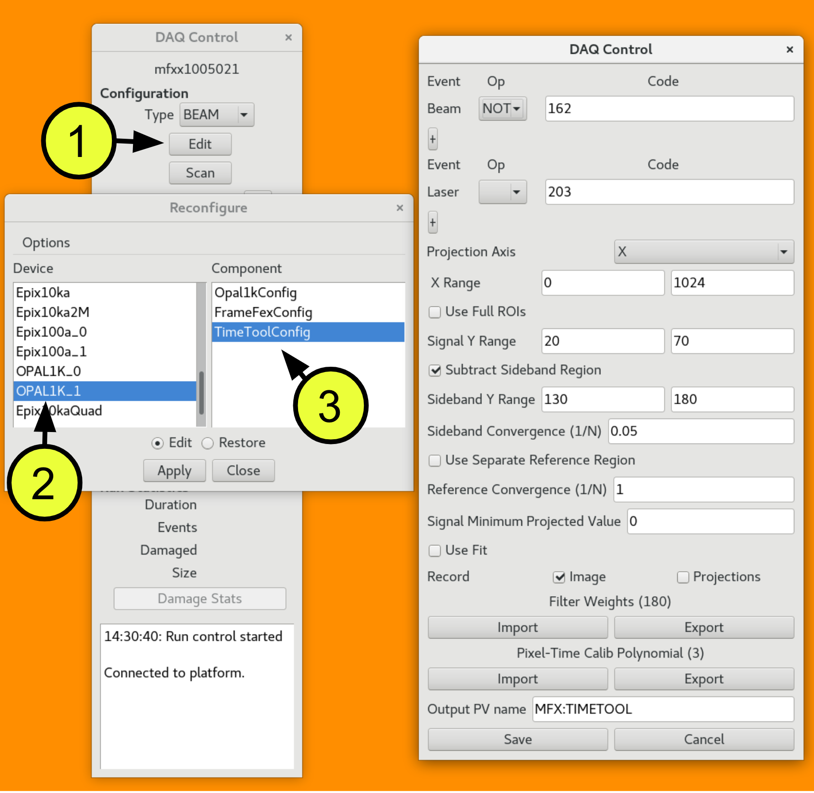

# Running the Timetool
If you are performing a pump-probe measurement requiring sub-picosecond time resolution, you will need to correct for the jitter in the X-ray arrival time. LCLS deploys a time tool to facilitate this. The theory of the tool is detailed [here](/before/timetool). Below you will find a step-by-step guide for setting up the tool, and ensuring it is calibrated and running well to ensure reliable jitter correction for your experiment.

This page, similarly to others, is divided into two sections, [**Setup**](#setup) and [**Analysis**](#analysis). The **Setup** section of the page contains information on the procedure to perform optical pulse/X-ray pulse cross-correlation for establishing "time-zero" - when both pulses arrive at the sample simultaneously - as well as for collecting the dataset used for time tool calibration. The **Analysis** section details how to analyze the calibration dataset to establish a jitter correction model, as well as how to apply that model to create accurate time stamps for events corresponding to experimental data.

##  Setup {: #setup}

### Cross-correlation
Before running the time tool it needs to be established that "time zero" at the sample interaction point is the same as the time tool's. The beams on both the timing and pump arms are synchronized; however, the variable path that they travel needs to be accounted for. This is accomplished through the use of delay stages. A cross-correlation measurement usually in cerium-yttrium aluminium garnet (Ce-YAG), will be used to confirm that the optical pulses arrive with the same x-ray pulse at both the sample IP and the time tool. The beam-line scientists and your point of contact will be able to confirm what material is available for you. The following section outlines the necessary procedure for performing the cross-correlation.

**Procedure**:

(TBA with Controls)

### Calibration Runs
Before the time tool can be employed it must be calibrated. During the process of cross-correlation a "time zero" was determined. This involved setting the position of an optical delay stage. That position is now known as the temporal zero in the DAQ, and distances can be set relative to it. By moving the delay stage so that the optical pulse arrives at discrete times before, or after, the X-ray pulse we can build up a calibration curve. Due to the jitter, for every nominal target time there will be a distribution of actual relative arrival times; however, by targetting a set of nominal delays we can fit a calibration curve through the centroids of these distributions. Refer to the theory [here](/before/timetool) if the concept and terminology are unfamiliar to you. Below you will find the procedure for setting up a run to collect the necessary calibration data. Fitting the calibration curve will be covered in the following section, under **Analysis**.

**Procedure**:

(TBA Thursday 2023/03/02)

|  | 
|:--:| 
| *__DAQ control interface to the Timetool.__ In the `DAQ Control` panel, (1) click `Edit`, (2) click `OPAL1K_1` or some equivalent device name, (3) click on `TimeToolConfig`. This will open the window on the left.* |

|  | 
|:--:| 
| *__DAQ control interface to the partition.__ To select what is recorded in the DAQ partition, (1) click `Select`, (2) click `opal_tt` to record the timetool raw image data.* |

[
&#8673;Back to Top
](#)

## Analysis {: #analysis}

During your experiment, the DAQ produced time stamps can generally be trusted. The main responsibility for those in charge of maintaining accurate timing is monitoring of the results. In particular, there are two things that should be verified frequently:

1. That the timing does not drift so far that the timetool can no longer correct the jitter. This can generally be corrected for with a simple move of the delay stage, without further modification of the timetool alignment or processing.
2. That the results of the timetool are reasonable. As mentioned, they should be, however, diagnositics, such as the detected edge position distributions, can help determine early on if there is a need to revisit the timetool calibration, or even address an alignment issue.
